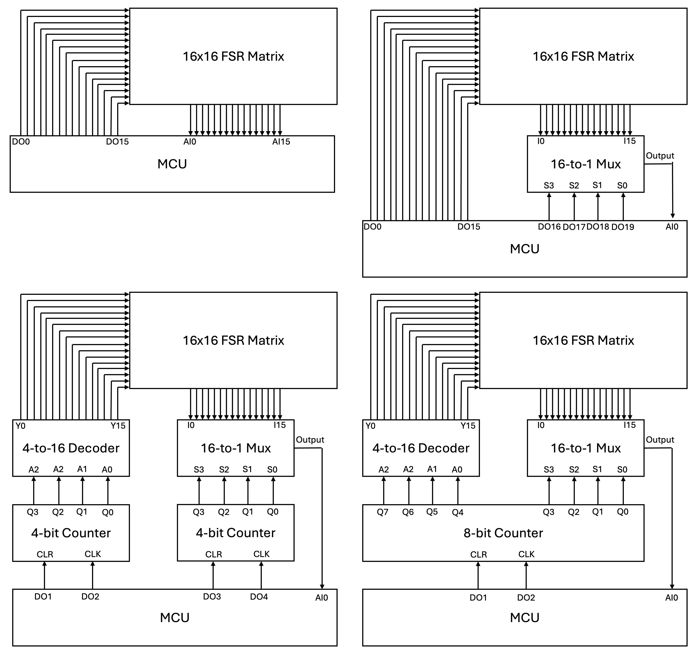

# FSR16x16_BNL
A library for arduino/MCU to read value of 16x16 FSR array sensor

This Arduino library is designed to scan a 16x16 FSR (Force Sensitive Resistor) pressure sensor matrix using **only 3 GPIO pins**.  
It implements a hardware-efficient approach using **an 8-bit binary counter and an analog multiplexer**, controlled by minimal digital clock and clear signals.

This minimizes the typical 32-pin (16 rows + 16 columns) setup to:
- **1 analog input pin** (multiplexer output)
- **2 digital pins** (clock + clear signals)

---

## 🛠️ Features
✅ Read all 256 points in the FSR matrix  
✅ Minimal GPIO usage: only 3 pins required  
✅ Clock-signal-based control (no complex communication)  
✅ Designed for small MCUs like Arduino Nano  
✅ Provides complete matrix data for serial output or external visualization

---

## 🔌 Circuit Setup

### Minimal 3-Pin Mode
This mode uses an 8-bit binary counter to reduce GPIO usage to just 3 pins:
- **Counter**: 8-bit binary counter IC (e.g., 74HC590)  
- **Decoder/Multiplexer**: connected to counter outputs  
- **MCU Pins**:
    - `clearPin` (digital): counter reset
    - `clockPin` (digital): counter clock pulse
    - `analogPin` (analog): reads multiplexer output

> 📖 Refer to the accompanying design paper for detailed wiring diagrams.  
> 📷 A sample circuit diagram for this mode is shown below.

---

### Direct Mode (32 GPIO Pins)
For applications where GPIO availability is not a concern, you can directly connect the MCU to the 16 rows and 16 columns of the FSR matrix:
- **MCU Pins**:
    - 16 digital pins for rows
    - 16 digital pins for columns
- This mode provides the fastest scanning speed but requires 32 GPIO pins.

---

### MUX/DEMUX Mode (9 GPIO Pins)
This mode uses a multiplexer for column reading and a demultiplexer for row selection to reduce the required GPIO pins:
- **Row Selection**: 4-to-16 line decoder (e.g., 74HC154) as a demultiplexer  
- **Column Reading**: Analog multiplexer for column outputs  
- **MCU Pins**:
    - 4 digital pins for row selection
    - 4 digital pins for column selection
    - 1 analog pin to read the multiplexer output
- This mode balances GPIO usage and scanning speed.

---

### TIMER4 Mode (5 GPIO Pins)
This mode uses a 4-bit binary counter for row selection and a multiplexer for column reading:
- **Counter**: 4-bit binary counter IC (e.g., 74HC161)  
- **Multiplexer**: Analog multiplexer for column outputs  
- **MCU Pins**:
    - `clearPin` (digital): counter reset
    - `clockPin` (digital): counter clock pulse
    - 2 digital pins for column selection
    - 1 analog pin to read the multiplexer output
- This mode minimizes GPIO usage further by reducing the total required pins to just 5.

---

### Combined Modes and Configurations
By combining the above modes, you can create up to **10 different circuit configurations**, including:
- **Row Configurations (3 types)**:  
    1. **Direct GPIO**: Each row is controlled by a dedicated GPIO pin.  
    2. **Demultiplexer**: A 4-to-16 line decoder (e.g., 74HC154) is used for row selection, reducing GPIO usage.  
    3. **Demultiplexer + 4-bit Counter**: Combines a demultiplexer with a 4-bit binary counter for efficient row selection.  

- **Column Configurations (3 types)**:  
    1. **Direct GPIO**: Each column is connected to a dedicated GPIO pin.  
    2. **Multiplexer**: An analog multiplexer is used to read column outputs, reducing GPIO usage.  
    3. **Multiplexer + 4-bit Counter**: Combines a multiplexer with a 4-bit binary counter for column reading.  

- **TIMER8 Mode**:  
    A single 8-bit binary counter is used for both row and column selection, requiring only minimal GPIO pins while maintaining full functionality.  

> 📷 A sample circuit diagram for one of these configurations is shown below.



---

## 📦 Installation

### Option 1: Install via Arduino Library Manager
1. Open the Arduino IDE.
2. Go to **Sketch** > **Include Library** > **Manage Libraries...**.
3. In the Library Manager, search for `FSR16x16_BNL`.
4. Click **Install** to add the library to your project.

### Option 2: Manual Installation
1. Download the library as a ZIP file from the [GitHub repository](https://github.com/your-repo-link).
2. Open the Arduino IDE.
3. Go to **Sketch** > **Include Library** > **Add .ZIP Library...**.
4. Select the downloaded ZIP file to install the library.

### Usage
After installation via the Library Manager, include the library in your Arduino sketch:
```cpp
#include <FSR16x16_BNL.h>
```

If installed manually, include it as:
```cpp
#include "FSR16x16_BNL.h"
```

---
## 🔧 Constructor Overview

This library provides **7 constructors** to initialize the `FSR16x16_BNL` object, allowing flexible configurations for different hardware setups. Below is a detailed explanation of each constructor and its parameters:

---

### 1. **Row: Direct/DE_MUX, Column: Direct**
```cpp
FSR16x16_BNL(pinSelectType rowT, int* rowPins, pinSelectType colT, int* colPins);
```

---

### 2. **Row: Direct/DE_MUX, Column: DE_MUX**
```cpp
FSR16x16_BNL(pinSelectType rowT, int* rowPins, pinSelectType colT, int* colPins, int outputPin);
```

---

### 3. **Row: Direct/DE_MUX, Column: Timer4**
```cpp
FSR16x16_BNL(pinSelectType rowT, int* rowPins, pinSelectType colT, int colClearPin, int colClearType, int colClockPin, int colClockType, int outputPin);
```

---

### 4. **Row: Timer4, Column: Direct**
```cpp
FSR16x16_BNL(pinSelectType rowT, int rowClearPin, int rowClearType, int rowClockPin, int rowClockType, pinSelectType colT, int* colPins);
```

---

### 5. **Row: Timer4, Column: DE_MUX**
```cpp
FSR16x16_BNL(pinSelectType rowT, int rowClearPin, int rowClearType, int rowClockPin, int rowClockType, pinSelectType colT, int* colPins, int outputPin);
```

---

### 6. **Row: Timer4, Column: Timer4**
```cpp
FSR16x16_BNL(pinSelectType rowT, int rowClearPin, int rowClearType, int rowClockPin, int rowClockType, pinSelectType colT, int colClearPin, int colClearType, int colClockPin, int colClockType, int outputPin);
```

---

### 7. **Row & Column: Timer8**
```cpp
FSR16x16_BNL(pinSelectType rowT, int clearPin, int clearType, int clockPin, int clkType);
```

---
### Key Notes
- **Row Type (`rowT`)**:
    - `DIRECT`: Requires an array of 16 pins for direct GPIO connection.
    - `DE_MUX`: Used when the row selection utilizes a demultiplexer. Requires an array of 4 pins for demultiplexer selection.
    - `TIMER4`: Requires `clearPin` and `clockPin` for counter control, with active edge types (`FALLING` or `RISING`).

- **Column Type (`colT`)**:
    - `DIRECT`: Requires an array of 16 pins for direct GPIO connection.
    - `DE_MUX`: Used when the column selection utilizes a multiplexer. Requires an array of 4 pins for multiplexer selection and an **output pin**.
    - `TIMER4`: Requires `clearPin`, `clockPin`, and an **output pin**, with active edge types (`FALLING` or `RISING`).

- **TIMER8 Mode**:
    - Combines row and column control into a single 8-bit counter, requiring `clearPin`, `clockPin`, and an **output pin**, with active edge types (`FALLING` or `RISING`).

> **Note**: The `DE_MUX` type is designed to represent configurations where either the rows use a demultiplexer or the columns use a multiplexer, or both.
---
## 🧪 Example Usage

```cpp
#include <Arduino.h>
#include "FSR16x16_BNL.h"

// Define pins for minimal GPIO mode
const int clearPin = 5;    // Counter clear/reset pin
const int clockPin = 6;    // Counter clock pin
const int analogPin = A0;  // Analog multiplexer output

// Initialize sensor in TIMER8 mode (single 8-bit counter)
FSR16x16_BNL sensor(TIMER8, clearPin, RISING, clockPin, RISING);

void setup() {
    Serial.begin(115200);
    sensor.begin();
}

void loop() {
    // Read the full 16x16 matrix
    sensor.read();

    // Example 1: Access individual value
    int centerValue = sensor.get(8, 8);
    Serial.print("Center (8,8): ");
    Serial.println(centerValue);

    // Example 2: Print full matrix over Serial
    Serial.println("Full matrix:");
    sensor.print();

    // Wait before next scan
    delay(1000);
}
```

---

## 🔍 Available Functions

| Function                      | Description                                        |
| ----------------------------- | -------------------------------------------------- |
| `begin()`                     | Initializes pins and setup.                         |
| `read()`                      | Scans all 256 points and stores readings.          |
| `get(row, col)`               | Returns the value at specified (row, col).         |
| `print()`                     | Prints the full 16x16 matrix to Serial.           |
| `clockDelay(type, time)`      | Configures delay between clock pulses (if needed). |

---

## 💡 Notes

- **Make sure to wire the hardware exactly as described** in the provided design document for the 3-pin setup.
- This library also supports more complex setups (DIRECT, DEMUX, TIMER4), but its main goal is to demonstrate the **minimum GPIO 3-pin configuration**.
- For visualizing the data, you can forward the serial output to Python or Processing to create real-time pressure maps.=